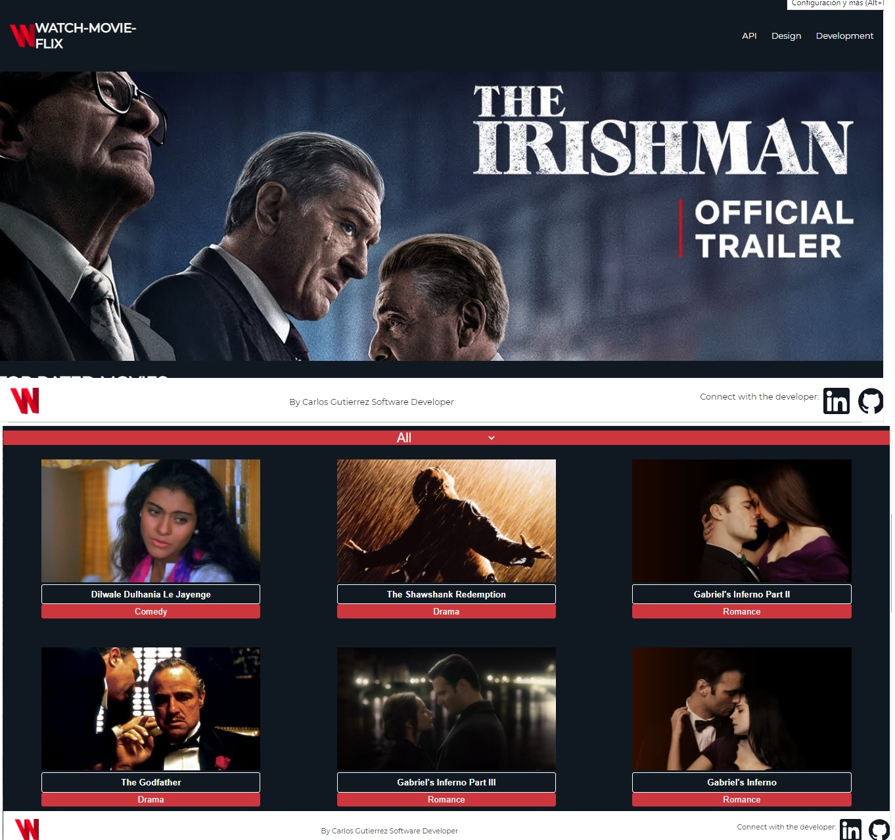

# WATCH - MOVIE - FLIX

This is a web application that keeps you updated about the Top Rated Movies at the moment. It is a fast and reliable app developed using React and Redux and fetches data from a standard API called TMDB.

On the Main Page is displayed a collection of the 20 top-rated movies at the moment.
You can filter the movies by category.
You can also click on the movie to check more details, such as a description, the average rate received, and tagline, when available.

## Development

The development of this project followed all the requirements listed:

    * The app fetches data from an external API
    * The data is retrieved in the Redux Store
    * The app has Unit Tests implemented
    * The test coverage is higher than 60%
    * The app Navigates

Built With:

   * Javascript
   * React
   * Redux
   * React-Redux
   * NPM

## Author

Github: cgcarlosg
Twitter: @cgcarlosg1
Linkedin: carlosalbeniogutierrez

